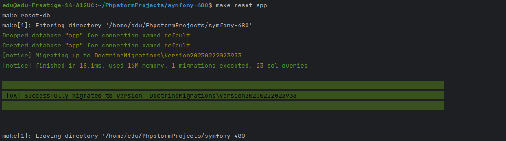
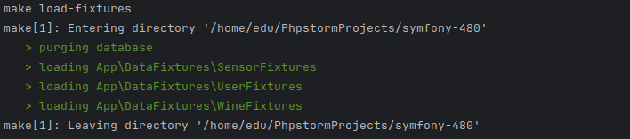

- [Instalacion](#instalación)
- [Makefile](#makefile)
- [Custom commands](#custom-commands)
- [Documentación](#documentación)
- [Reporte cobertura](#documentación)

---

```
mkdir symfony-480
cd symfony-480
git clone https://github.com/rzeronte/symfony-480.git .
make build
make up
```

---

# Makefile

La aplicación dispone de un `Makefile` que permitirá interactuar con la aplicación:


---

# Reset de la aplicación

Si deseamos resetear la aplicación a un estado inicial:
```
make reset-app
```

Este comando ejecutará en orden los siguientes:

- `make reset-db`: Resetea BBDD y lanza migraciones
- `make load-fixtures`: Carga de fixtures
- `make test`: Lanza los tests
- `make coverage`: Genera reporte de coverage
- `make php-cs-fixer`: Lanza linter con autofix
- `make phpstan`: Lanza analizador estático

---

# Custom commands

Disponemos de una serie de comandos personalizados para la aplicación:

1) `` make reset-db``



---

2) `` make load-fixtures``



---

3) `` make test``


---

4) `` make coverage``


---

5) `` make php-cs-fixer``


---

6) `` make phpstan``


# Documentación

La aplicación ofrece la documentación a través del endpoint `api/docs`.


# Reporte cobertura

En la carpeta `report` se puede encontrar en formato HTML el reporte de covertura.


